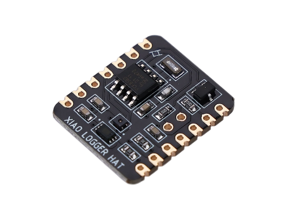
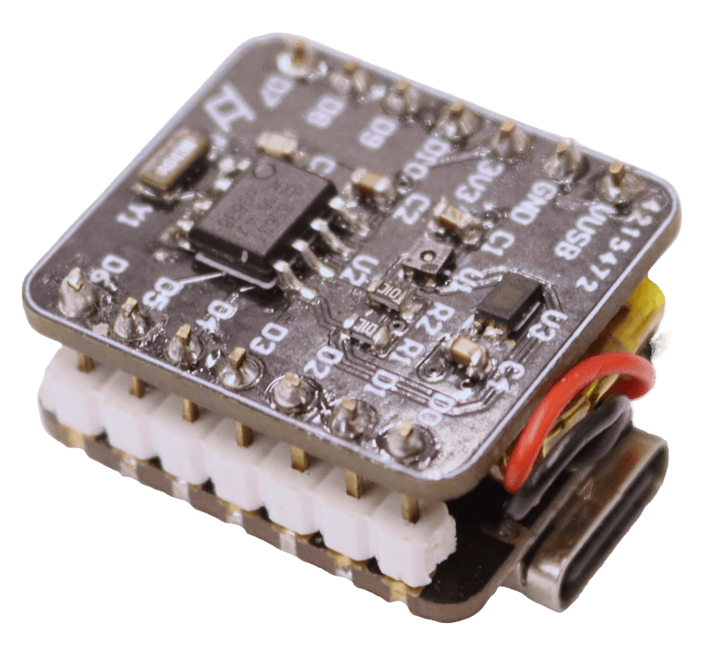

  
  &nbsp;&nbsp;&nbsp;&nbsp;&nbsp;&nbsp;&nbsp;&nbsp;&nbsp;&nbsp;
  

_Arduino Zigbee Code_  [here](https://github.com/potblitd/XIAO-log/blob/main/zigbee/z-xiaohat.ino)

# XIAO log
The XIAO-LOG is a ‘hardware attached on top’ module for the XIAO Series microcontroller boards, providing temperature, humidity and ambient light measurements. The SHT40 and BH1750 sensors communicate through I2C, making it easy to program and get started. Their power supply is enabled by GPIO pin D10 to allow no-power sleep mode. Additionally, the onboard PCF8563 real-time clock can be used to keep precise timing and send a timed interrupt to the microcontroller. A voltage divider connected between the battery and the ADC output makes battery voltage monitoring possible. With its thumb-sized footprint and castellated header pins, this logger module perfectly fits on most of the XIAO boards and can accommodate more expansion boards. The module is a co-create collaboration with Seeed Studio and can be pruchased [here](https://www.seeedstudio.com/XIAO-LOG-p-6341.html).

## Description

The XIAO-LOG is a tiny environmental sensors module, specifically tailored for the XIAO microcontroller boards. It comprises two sensors : the SHT40 and the BH1750, measuring temperature, humidity, and ambient light. The chips use I2C communication on pin D4 and D5 to receive commands and send data to the XIAO microcontroller. On the same bus is also the PCF8563 real-time clock that provides precise timing and a programmable interrupt to wake up the XIAO board on pin D0 from deep sleep at exactly the right time. With these commonly used chips, the dev board can easily be programmed with existing libraries, both in micropython or on the arduino platform. 

For wireless battery-powered loggers, the resistor divider connecting the battery with ADC pin A3, is notably useful to monitor and keep track of the battery voltage level. To achieve the lowest power consumption, the sensors and the divider are powered through GPIO pin D10 while the always-on RTC chip only consumes about 250nA.

The dimensions of the XIAO-LOG board are the same as the XIAO boards, making it suitable for a sandwich configuration with the lithium-ion battery in between the two boards or for just stacking them. The castellated ‘post stamp’ headers on the board are friendly for breadboard setups and more HAT expansion layers.

## Specifications

| Item | Details |
| --- | --- |
| Size | 21mm x 17.75mm |
| Operating Temperature | -40°C to 85°C |
| Power Supply range | 2.4V ~ 3.6V |
| Current consumption | ~ 500uA |
| Idle current consumption | ~ 0.25uA |
| Communication Interface | I2C (D4/SDA and D5/SCL), ADC (D3/D3) |
| PCF8563 read time | TBA |
| SHT40 read time | ~ 2ms |
| BH1750 read time| ~ 120ms |
| Compatibility (all features) | XIAO ESP32C3, NRF54820, RP2350, MG24, ESP32C6 |
| Compatibility (no battery monitoring) | XIAO SAMD21, RP2040 | 

## Pinout Connections

## Programming

### Python
The easiest way to get micropython on the ESP32C3 chip is to download the firmware [here](https://micropython.org/download/), enter bootloader mode by holding the BOOT button down while pressing the RESET button, and then flash the chip with the bin file using [esptool](https://docs.espressif.com/projects/esptool/en/latest/esp32/) through the command prompt at the right COM port. With the [Thonny IDE](https://thonny.org/), the onboard files can easily be managed, and codes can be run directly without uploading them. 

This [basic code](code/xiaohat.py) implements all the features of the module.

Currently, the only way to connect the ESP32C3 board while in deep sleep for retrieving the log file, is to physically reset the board and click the restart backend button within the 10 seconds delay before the code continues and arrives back to deep sleep again. 

### Home Assistant 
The XIAO log devie can also be integrated into into Home Assistant thourgh ESPHome with this [example](code/esphome-xiaohat.yaml) code. 

