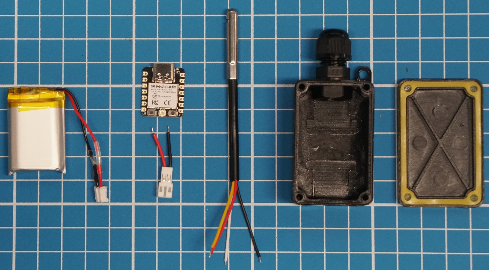
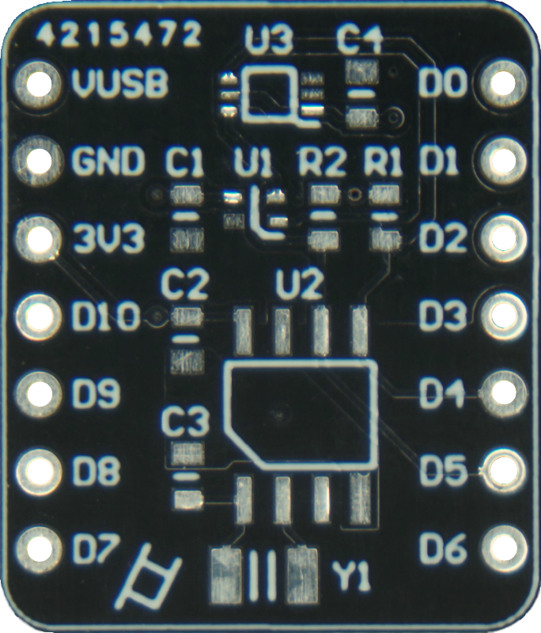
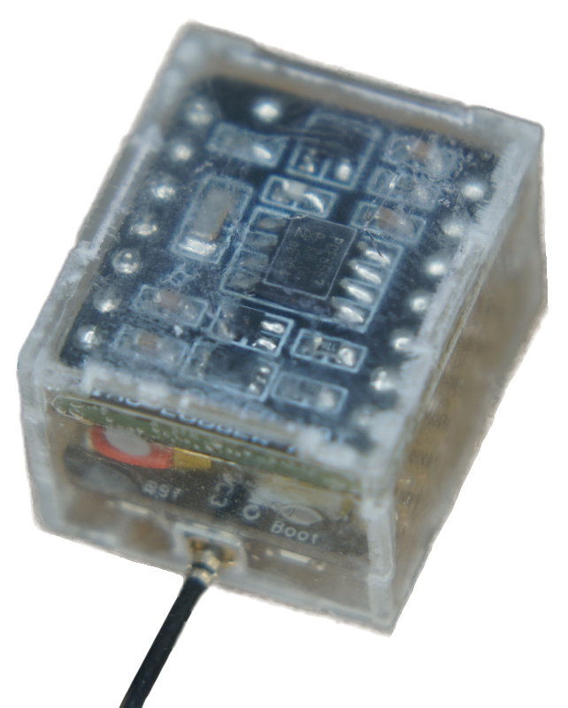

# XIAO log

The lack of a simple and cost-effective device to measure temperature and humidity autonomously in remote, outdoor locations is astonishing. Specifically in ecological studies, to collect data, researchers often use the [Ibutton](https://www.ibuttonlink.com/collections/thermochron) logger that was released some 20 years ago and comes at a starting price of 36.70 USD. Needless to say, with today’s rise of CMOS, SoC, IoT and B2C, it’s about time to give those poor government-funded researchers an alternative and open-source solution for a simple temperature and humidity logging device. It should be noted that this post does not describe a buyable product but rather an easy setup with minimal components and cost.

## Materials

The XIAO log is composed of a microcontroller board, a battery and the temperature and humidity sensor probe. Although the [XIAO ESP32C3](https://www.seeedstudio.com/Seeed-XIAO-ESP32C3-p-5431.html) might seem a bit overkill for this application, it includes plenty of features that could be useful for future upgrades and variations. Also, its dirt [cheap](https://item.taobao.com/item.htm?spm=a230r.1.14.1.19487f1bpjLVY4&id=683550586572&ns=1&abbucket=17#detail) and trendy. For the sensor, a [waterproof probe](https://item.taobao.com/item.htm?spm=a230r.1.14.16.859f5271yamPh0&id=666936799925&ns=1&abbucket=17#detail) encasing the SHT40 chip (±0.2°C/±1.8%RH accuracy) should be suitable here. Lastly, the battery must be 3.7V lithium-ion to supply power and work with the dev board’s integrated battery charger. Its size can be chosen according to the housing dimensions. With [this waterproof box](https://detail.tmall.com/item.htm?abbucket=17&id=681093549681&ns=1&skuId=4882866353482&spm=a230r.1.14.16.6ee324ccSCpNRs), the total cost of XIAO log is about 71.76 RMB or 10.45 USD.

<ins>Note</ins> : The XIAOs internal RTC is garbage. An external RTC should be used for reliable time keeping. See PCB shields logRTC and log<sup>2</sup>.

<p align="center">
  
</p>

## Assembly

Instead of soldering the battery directly onto the chip, a connector is fixed to facilitate removal and power OFF. The sensor uses I2C protocol which can be configured on pins D4 (SDA) and D5 (SCL). By connecting the VCC power supply for the sensor on a GPIO, such as D10, it can be powered only when needed and therefore reduce Xiao log's power consumption during his deep sleep period.

<p align="center">
  
  &nbsp;&nbsp;&nbsp;&nbsp;&nbsp;&nbsp;&nbsp;&nbsp;&nbsp;&nbsp;
  
</p>

## Code

The easiest way to get micropython on the ESP32C3 chip is to download the firmware [here](https://micropython.org/download/esp32c3-usb/), enter bootloader mode by holding the BOOT button down while pressing the RESET button, and then flash the chip with the bin file using [esptool](https://docs.espressif.com/projects/esptool/en/latest/esp32/) through the command prompt at the right COM port. With the [Thonny IDE](https://thonny.org/), the onboard files can easily be managed, and codes can be run directly without uploading them. The example code below is simple : it gets the RTC time, reads temperature and humidity from the sensor, writes all these values in a file and then calculates the time until the next measurement based on the logging period before going into deep sleep.

```ruby
# PARAMETERS
log_period = 60
 
# LIBRAIRIES
import os, time, machine

# DELAY ON RESET FOR IDE CONNECTION
if machine.reset_cause() == 1: time.sleep_ms(10000)
 
# DATE & TIME
now = time.localtime()
now_date = "-".join(map(str, now[0:3]))
now_time = ":".join(map(str, now[3:6]))
print("Date and time:", now_date, now_time)

# I2C INIT
i2c = machine.SoftI2C(sda=machine.Pin(6),scl=machine.Pin(7))

# TEMPERATURE & HUMIDITY
machine.Pin(10, machine.Pin.OUT).on()
time.sleep_ms(1)
i2c.writeto(0x44, bytes([0XFD]))
time.sleep_ms(10)
buf = i2c.readfrom(0x44, 6)
machine.Pin(10, machine.Pin.OUT).off()
temp = -45 + 175 * (buf[0]*256 + buf[1]) / 65535
humi = -6 + 125 * (buf[3]*256 + buf[4]) / 65535
print("Temperature: %0.2f C" % temp)
print("Humidity: %0.2f %%" % humi)
 
# VALUES LOG
if not "log.csv" in os.listdir():
    with open("log.csv", "a") as log:
        log.write("date,time,temp,hum\n")
with open("log.csv", "a") as log:
    log.write(now_date+","+now_time+","+str(temp)+","+str(humi)+"\n")
 
# DEEP SLEEP TIME
sleep_time = log_period - ((now[4]*60 + now[5]) % log_period)
print("Going to sleep for %0.2f minutes" % (sleep_time/60))
machine.deepsleep(sleep_time*1000)
# end
```

Currently, the only way to connect the ESP32C3 board while in deep sleep for retrieving the log file, is to physically reset the board and click the restart backend button within the 10 seconds delay before the code continues and arrives back to deep sleep again. 

## Performance

The current consumption during the measurements and logging is about 20mA and takes around 2 seconds. In deep sleep, XIAO log draws 42uA from his battery which is *nice* considering the RTC time is still running. So, with the 500mAh battery from this setup, XIAO log can theoretically run for 29 days with a 60 seconds logging cycle. The graph below shows his actual run with temperature, humidity and battery voltage measurement and file write every minute. After 35 days, the battery voltage dropped below 3.3V and the microcontroller stopped functioning which means the calculations above are reliable. With a log cycle of 10 minutes or 1 hour, XIAO log could therefore operate for 241 days or 392 days, respectively. 

<p align="center">
  
  
</p>
It should also be noted that during this run, XIAO log didn't skip or mess up a single one of the total 49342 measurements and file logs. Good job XIAO log !

# XIAO logRTC

Adding accurate time keeping and a battery voltage reading to the XIAO ESP32C3 with this weird shaped PCB. Here the PCF8563 RTC chip is powered continuously through the 3V3. The battery voltage divider is enabled through D10 and the halved voltage can be read on A3. Footprints and silkscreen are specifically designed to help for manual soldering.

<p align="center">
  
  &nbsp;&nbsp;&nbsp;&nbsp;&nbsp;&nbsp;&nbsp;&nbsp;&nbsp;&nbsp;
  
</p>

## Assembly

After mounting the SMD components, the module is intended to be soldered directly onto the XIAO board (screw heat dissipation), connecting the BAT+ pins together while leaving space for a connector or wires. 

<p align="center">
  
  &nbsp;&nbsp;&nbsp;&nbsp;&nbsp;&nbsp;&nbsp;&nbsp;&nbsp;&nbsp;
  
</p>

## Code

*set_rtc.py* sets the time on PCF8563 form the local time on the PC.

The *logmain.py* code can be used for all variations in this repo. The *read_battery* parameter is used to enable battery voltage reading through D10 and A3. I2C comunication is initialized and, according to the adresses on the bus, values from the real-time clock (PCF8563), temperature & humidty sensor (SHT40) and ambient light sensor (BH1750) are retrieved. This data is then written into a file and send over WiFi to a cloud if *wifi_update* is enabled and its corresponding parameters are set up. Finally, the time until the next measurement is calculated based on the *log_period* time and deep sleep is activated.

Use the *test* variable to avoid the logger going to deep sleep and loosing connection when testing the code. Also, to access files when plugging the USB-C cable to a PC, resetting the board gives the user 10 seconds to connect to an IDE.

# XIAO log<sup>2

Seeking compactness and all-in-one-ness, a logger hat was designed for the XIAO ESP32C3. Both V1 and V2 include the previously used SHT40 temperature sensor, the popular BH1750 ambient light sensor and the PCF8563 RTC chip to correct the godawful internal clock. The RTC is powered by the 3V3 and the two sensor chips are powered through pin D10. Communication is done through I2C pins D4 (SDA) and D5 (SCL). The second version also features a battery voltage divider that is enabled through D10 and the halved voltage can be read on pin A3. This circuitry requires wiring the battery power to the hat. The PCB and components costs for this module sum up to 9.81 RMB (1.37 USD).

<p align="center">
  
  &nbsp;&nbsp;&nbsp;&nbsp;&nbsp;&nbsp;&nbsp;&nbsp;&nbsp;&nbsp;
  
  &nbsp;&nbsp;&nbsp;&nbsp;&nbsp;&nbsp;&nbsp;&nbsp;&nbsp;&nbsp;
  
</p>

## Assembly
SMD components are soldered on the shield first. V2 has adapted silkscreen and pads for easier manual soldering. The populated PCB is then soldered on the header pins of XIAO with an adequately-sized lithium battery sandwiched between the two boards. For V2, a wire must be added to get the battery voltage.

<p align="center">
  
  &nbsp;&nbsp;&nbsp;&nbsp;&nbsp;&nbsp;&nbsp;&nbsp;&nbsp;&nbsp;
  
  &nbsp;&nbsp;&nbsp;&nbsp;&nbsp;&nbsp;&nbsp;&nbsp;&nbsp;&nbsp;
  
  &nbsp;&nbsp;&nbsp;&nbsp;&nbsp;&nbsp;&nbsp;&nbsp;&nbsp;&nbsp;
  
</p>

An acrylic cuboid was designed to tightly encase the entire system with holes for the USB-C connector, the U.FL antenna connector and access to the reset button. The complete assembly measures just 23.3 mm x 20 mm x 16.2 mm (without antenna) and the total cost is 46.65 RMB (6.52 USD). 


