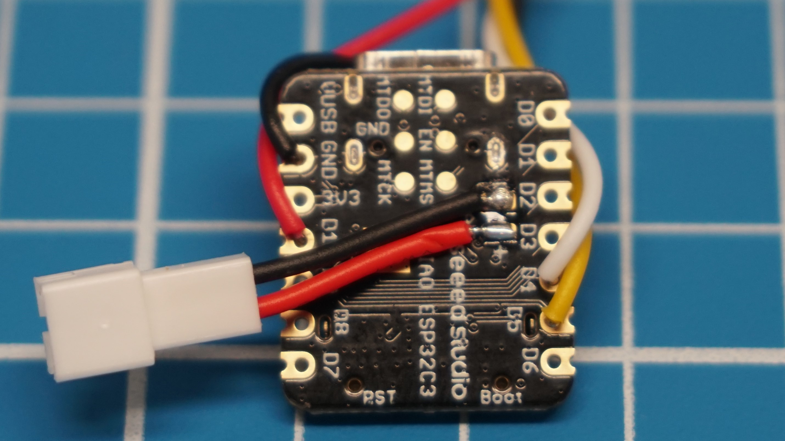
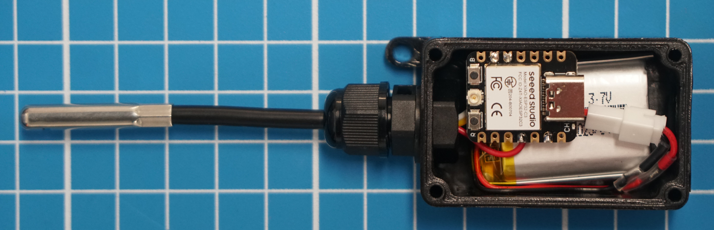

# loglog

The lack of a simple and cost-effective device to measure temperature and humidity autonomously in remote, outdoor locations is astonishing. Specifically in ecological studies, to collect data, researchers often use the [Ibutton](https://www.ibuttonlink.com/collections/thermochron) logger that was released some 20 years ago and comes at a starting price of 36.70 USD. Needless to say, with today’s rise of CMOS, SoC, IoT and B2C, it’s about time to give those poor government-funded researchers an alternative and open-source solution for a simple temperature and humidity logging device. It should be noted that this post does not describe a buyable product but rather an easy setup with minimal components and cost.

## Materials

The circuit is composed of a microcontroller board, a battery and the temperature and humidity sensor probe. Although the [XIAO ESP32C3](https://www.seeedstudio.com/Seeed-XIAO-ESP32C3-p-5431.html) might seem a bit overkill for this application, it includes plenty of features that could be useful for future upgrades and variations. Also, its dirt [cheap](https://item.taobao.com/item.htm?spm=a230r.1.14.1.19487f1bpjLVY4&id=683550586572&ns=1&abbucket=17#detail) and trendy. For the sensor, a [waterproof probe](https://item.taobao.com/item.htm?spm=a230r.1.14.16.859f5271yamPh0&id=666936799925&ns=1&abbucket=17#detail) encasing the SHT40 chip (±0.2°C/±1.8%RH accuracy) should be suitable here. Lastly, the battery must be 3.7V lithium-ion to supply power and work with the dev board’s integrated battery charger. Its size can be chosen according to the housing dimensions. With [this waterproof box](https://detail.tmall.com/item.htm?abbucket=17&id=681093549681&ns=1&skuId=4882866353482&spm=a230r.1.14.16.6ee324ccSCpNRs), the total cost is about 71.76 RMB or 10.45 USD.

  

## Assembly

Instead of soldering the battery directly onto the chip, a connector is fixed to facilitate removal and power OFF. The sensor uses I2C protocol which can be configured on pins D4 (SDA) and D5 (SCL). By connecting the power supply for the sensor on a GPIO, such as D10, it can be powered only when needed and therefore reduce the power consumption during the deep sleep phase.

  

  

## Code

The easiest way to get micropython on the ESP32C3 chip is to download the firmware [here](https://micropython.org/download/esp32c3-usb/), enter bootloader mode by holding the BOOT button down while pressing the RESET button, and then flash the chip with the bin file using [esptool](https://docs.espressif.com/projects/esptool/en/latest/esp32/) through the command prompt at the right COM port. With the [Thonny IDE](https://thonny.org/), the onboard files can easily be managed, and codes can be run directly without uploading them. The example code below is simple : it gets the RTC time, reads temperature and humidity from the sensor, writes all these values in a file and then calculates the time until the next measurement based on the log period before going into deep sleep.

Currently, the only way to connect the ESP32C3 board while in deep sleep for retrieving the log file, is to physically reset the board and quickly click the restart backend button before the code arrives at the deep sleep again.

## Performance

The current consumption during the measurements and logging is about 20mA and takes about 2 seconds. In deep sleep, the system draws 42uA from the battery which is *nice* considering the RTC time is still running. So, with the 1000mAh battery from this setup, the loggers can theoretically run for 58 days with 60 seconds log period. To verify this mad claim, here is a graph of the battery level during this logging run.

*[coming in 58 days]*

