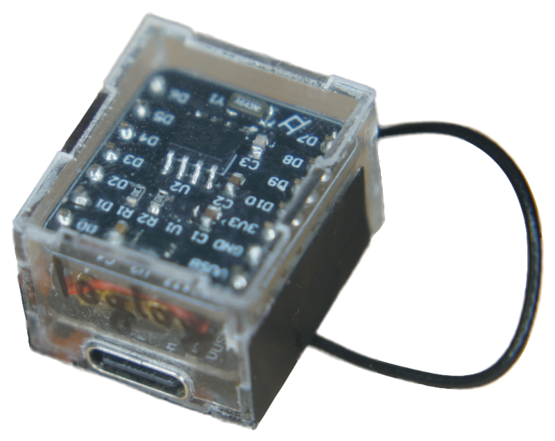

# log2

Seeking compactness and all-in-one-ness, a logger hat was designed for the XIAO ESP32C3. Both V1 and V2 include the previously used SHT40 temperature sensor, the popular BH1750 ambient light sensor and the PCF8563 RTC chip to correct the godawful internal clock. The RTC is powered by the 3V3 and the two sensor chips are powered through pin D10. Communication is done through I2C pins D4 (SDA) and D5 (SCL). The second version also features a battery voltage divider that is enabled through D10 and the halved voltage can be read on pin A3. This circuitry requires wiring the battery power to the hat. The PCB and components costs for this module sum up to 9.81 RMB (1.37 USD).

  
  &nbsp;&nbsp;&nbsp;&nbsp;&nbsp;&nbsp;&nbsp;&nbsp;&nbsp;&nbsp;
  
  &nbsp;&nbsp;&nbsp;&nbsp;&nbsp;&nbsp;&nbsp;&nbsp;&nbsp;&nbsp;
  

## Assembly
SMD components are soldered on the shield first. V2 has adapted silkscreen and pads for easier manual soldering. The populated PCB is then soldered on the header pins of XIAO with an adequately-sized lithium battery sandwiched between the two boards. For V2, a wire must be added to get the battery voltage.
An acrylic cuboid was designed to tightly encase the entire system with holes for the USB-C connector, the U.FL antenna connector and access to the reset button. The complete assembly measures just 23.3 mm x 20 mm x 16.2 mm (without antenna) and the total cost is 46.65 RMB (6.52 USD). 

  
  &nbsp;&nbsp;&nbsp;&nbsp;&nbsp;&nbsp;&nbsp;&nbsp;&nbsp;&nbsp;
  
  &nbsp;&nbsp;&nbsp;&nbsp;&nbsp;&nbsp;&nbsp;&nbsp;&nbsp;&nbsp;
  
  &nbsp;&nbsp;&nbsp;&nbsp;&nbsp;&nbsp;&nbsp;&nbsp;&nbsp;&nbsp;
  

## Code

*set_rtc.py* sets the time on PCF8563 form the local time on the PC.

The *logmain.py* can be used for this board. The *read_battery* parameter is used to enable battery voltage reading through D10 on A3. I2C comunication is initialized and, according to the adresses on the bus, values of the real-time clock (PCF8563), temperature & humidty sensor (SHT40) and ambient light sensor (BH1750) are retrieved. This data is then written into a file and send over WiFi to a cloud if *wifi_update* is enabled and the corresponding parameters are set up. Finally, the time until the next measurement is calculated based on the *log_period* and deep sleep is activated.

Use the *test* variable to avoid the logger going to deep sleep and loosing connection when testing the code. Also, to acess files after a run, resetting the board gives the user 10 seconds to connect to an IDE.

