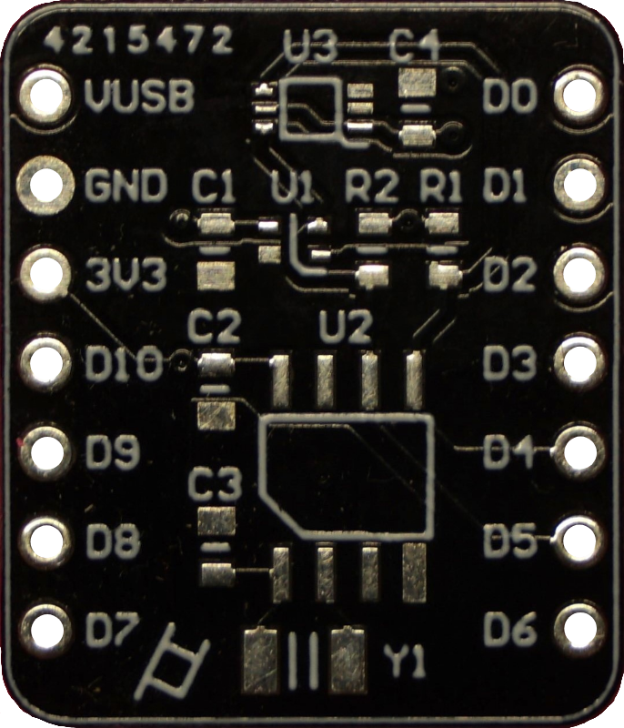

# log2

Seeking compactness and all-in-one-ness, a logger shield was designed for the XIAO ESP32C3. V1 includes the previously used SHT40 temperature sensor, the popular BH1750 ambient light sensor and the PCF8563 RTC chip to correct the godawful internal clock. The RTC is powered by the 3V3 while the two sensor chips are powered through pin D10. Communication is done through I2C pins D4 (SDA) and D5 (SCL). The second version also features a battery voltage divider that is enabled through D10 and the halved voltage can be read on pin A3. this features requires wiring the battery power to the shield.

  
  &nbsp;&nbsp;&nbsp;&nbsp;&nbsp;&nbsp;&nbsp;&nbsp;&nbsp;&nbsp;
  

Size is 22.5 mm x 18 mm x 13 mm

## Code

*set_rtc.py* can be used to set the time on PCF8563 form the local time on the PC.

The *logmain.py* can be used for this board. The *read_battery* parameter is used to enable battery voltage reading through D10 and A3. I2C comunication is initialized and, according to the adresses on the bus, values the real-time clock (PCF8563), temperature & humidty sensor (SHT40) and ambient light sensor (BH1750) are retrieved. This data is then written into a file and send over WiFi to a cloud if *wifi_update* is enabled and the corresponding parameters are set up. Finally, the time until the next measurement is calculated based on the *log_period* and deep sleep is activated.

Use the *test* variable to avoid the logger going to deep sleep and loosing connection when testing the code. Also, to acess files after a run, resetting the board gives the user 10 seconds to connect to an IDE.

