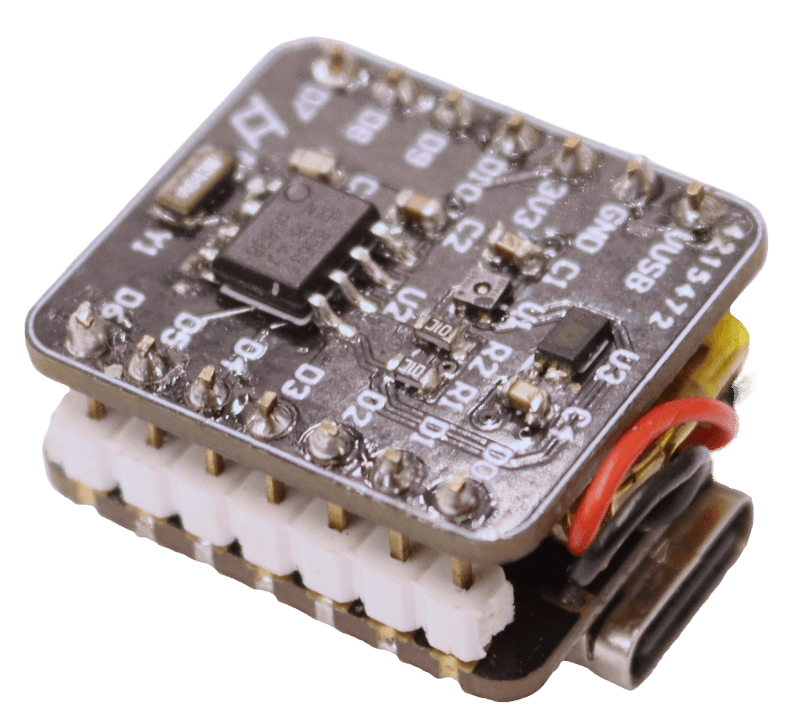

# log^3</3>

Seeking compactness and all-in-one-ness, a logger shield was deisgned for the XIAO ESP32C3. It includes the previously used SHT40 temperature sensor, the popular BH1750 ambient light sensor and the PCF8563 RTC chip to correct the godawful internal clock.

  

## Assembly

Just solder the components on the right footprint, not much to explain here. I also squeezed a 100mAh Li-ion battery between the two PCB boards. Neat.

## Code

*set_rtc.py* can be used to set the time on PCF8563 form the local time on the PC.

*xiaologhot.py* doesn't need any external libraries so it looks complicated. But its actually not. Code inits I2C comunication, gets the RTC time, reads temperature and humidity from the SHT40 sensor, read ambient light from the BH1750 sensor, tries to connect to the wifi and sends measurements to a server if that's enabled, writes all these values in a file and then calculates the time until the next measurement based on the log period before going into deep sleep.

Use the *tes* variable to avoid the logger going to deep sleep and loosing connection when testing the code. Also, to acess files after a run, connecting or resetting the board gives the user 10 seconds to do so.

